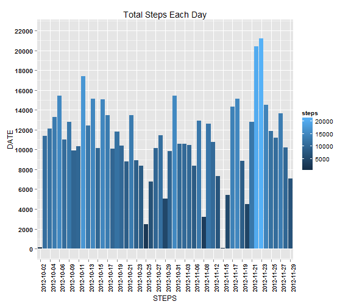
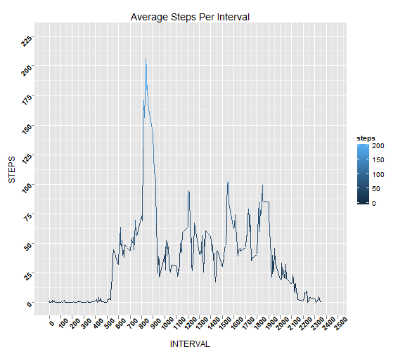
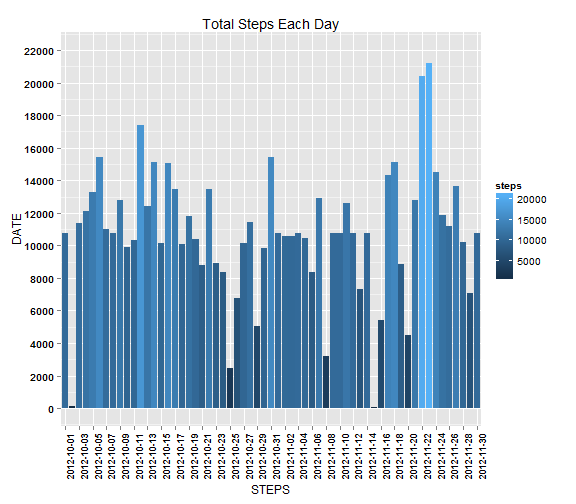

#Literate Statistical Programming Assignment.
This assignment will be described in multiple parts. You will need to write a report that answers the questions detailed below. Ultimately, you will need to complete the entire assignment in a single R markdown document that can be processed by knitr and be transformed into an HTML file.  

Throughout your report make sure you always include the code that you used to generate the output you present. When writing code chunks in the R markdown document, always use echo = TRUE so that someone else will be able to read the code. This assignment will be evaluated via peer assessment so it is essential that your peer evaluators be able to review the code for your analysis.  

For the plotting aspects of this assignment, feel free to use any plotting system in R (i.e., base, lattice, ggplot2)  

Fork/clone the GitHub repository created for this assignment. You will submit this assignment by pushing your completed files into your forked repository on GitHub. The assignment submission will consist of the URL to your GitHub repository and the SHA-1 commit ID for your repository state.  

NOTE: The GitHub repository also contains the dataset for the assignment so you do not have to download the data separately.  

##Loading required packages
Load the 'dplyr' and 'ggplot2' packages using the library().

```r
library(dplyr)
library(ggplot2)
```

##Loading and Preprocessing the data
Make sure the Activity.csv file is in the directory.  
The activity data-set is grouped by 'date', also I've kept an additional dataset without NA variables which may be needed in some cases.

```r
activity<-read.csv("activity.csv",stringsAsFactors=F)
activity<-group_by(activity,date)
activity_noNA<-filter(activity,!is.na(steps))
activity
```

```
## Source: local data frame [17,568 x 3]
## Groups: date
## 
##    steps       date interval
## 1     NA 2012-10-01        0
## 2     NA 2012-10-01        5
## 3     NA 2012-10-01       10
## 4     NA 2012-10-01       15
## 5     NA 2012-10-01       20
## 6     NA 2012-10-01       25
## 7     NA 2012-10-01       30
## 8     NA 2012-10-01       35
## 9     NA 2012-10-01       40
## 10    NA 2012-10-01       45
## ..   ...        ...      ...
```

##Calculating total steps per day
The summarise function sums up the total steps for each date.  
I have not ignored the NA's , as NA values are important too indicating the values were 'Not Available'

```r
stepsPerDay<-summarise(activity,steps=sum(steps))
stepsPerDay
```

```
## Source: local data frame [61 x 2]
## 
##          date steps
## 1  2012-10-01    NA
## 2  2012-10-02   126
## 3  2012-10-03 11352
## 4  2012-10-04 12116
## 5  2012-10-05 13294
## 6  2012-10-06 15420
## 7  2012-10-07 11015
## 8  2012-10-08    NA
## 9  2012-10-09 12811
## 10 2012-10-10  9900
## ..        ...   ...
```

##Plot Histogram of total steps per day
I've used the ggplot2 functions for ploting the histogram.  
Here the NA values are ignored as they are coerced to zero, when plotted show zero for that particular date.

```r
stepsPerDay_noNA<-summarise(activity_noNA,steps=sum(steps))
plot1<-ggplot(stepsPerDay_noNA)
plot1 + geom_histogram(aes(y=steps,x=date,fill=steps),stat="identity")+theme(axis.text.x=element_text(angle=90,size=5.5,face="bold",colour="black"),axis.text.y=element_text(face="bold",colour="black"))+labs(x="STEPS",y="DATE",title="Total Steps Each Day")+scale_y_continuous(limits=c(0,22000),breaks=seq(0,22000,by=2000))
```




##Calculating Mean and Median of total number of steps taken per day
The mean() and median() are used and applied on the variable containing the summarised total number of steps per each date.

```r
mean(stepsPerDay_noNA$steps)
```

```
## [1] 10766.19
```

```r
median(stepsPerDay_noNA$steps)
```

```
## [1] 10765
```

##Calculating Average Daily Activity Patterns
I've grouped the data-set by interval.  
After summarising by mean of steps(using summarise function), we get average steps per interval

```r
activityByInt<-group_by(activity,interval)
avgStepsPerInterval<-summarise(activityByInt,steps=mean(steps,na.rm=T))
avgStepsPerInterval
```

```
## Source: local data frame [288 x 2]
## 
##    interval     steps
## 1         0 1.7169811
## 2         5 0.3396226
## 3        10 0.1320755
## 4        15 0.1509434
## 5        20 0.0754717
## 6        25 2.0943396
## 7        30 0.5283019
## 8        35 0.8679245
## 9        40 0.0000000
## 10       45 1.4716981
## ..      ...       ...
```

##Plotting Average Number of Steps per Interval
I've used the ggplot2 functions.  

```r
plotStepsPerInterval<-ggplot(avgStepsPerInterval)
plotStepsPerInterval+geom_line(aes(x=interval,y=steps,colour=steps))+labs(x="INTERVAL",y="STEPS",title="Average Steps Per Interval")+scale_x_continuous(limits=c(0,max(avgStepsPerInterval$interval)+100),breaks=seq(0,2500,by=100))+scale_y_continuous(limits=c(0,225),breaks=seq(0,225,by=25))+theme(axis.text=element_text(angle=45,face="bold",colour="black"))
```



##Calculating the Interval with maximum number of steps, on average accross all the days.  
First we calculate the maximum number of steps per each interval. For this I've grouped by interval and summarissed by sum of steps on the data set.

```r
sumStepsPerInterval<-summarise(activityByInt,steps=sum(steps,na.rm=T))
as.data.frame(filter(sumStepsPerInterval,steps==max(steps)))
```

```
##   interval steps
## 1      835 10927
```

##Calculating and Reporting Total Missing Values
Here, I've used the is.na(),which() and length() to return the number of NA values in the data-set.(See documentation of the functions)

```r
length(which(is.na(activity$steps)))
```

```
## [1] 2304
```

##Creating an imputed data-set.  
In this step, I've considered the average steps per interval and rounded them off for imputation of NA values.  
The which functions points the indices of NA values in the data-set.  
This index is then used to find out the dates associated with NA values.  


```r
roundedAvgStepsPerInterval<-mutate(avgStepsPerInterval,steps=round(steps))
index<-which(is.na(activity))           #store indices of NA values
NAdates<-unique(activity$date[index])   #store dates having NA values
imputeActivity<-as.data.frame(activity) #new data-set for imputation
for(i in 1:length(NAdates))             #Assign rounded average values of steps
    {                                   #of intervals to impute NA values
    imputeActivity[imputeActivity$date==NAdates[i],]$steps<-as.integer(roundedAvgStepsPerInterval$steps)
    }
head(imputeActivity)
```

```
##   steps       date interval
## 1     2 2012-10-01        0
## 2     0 2012-10-01        5
## 3     0 2012-10-01       10
## 4     0 2012-10-01       15
## 5     0 2012-10-01       20
## 6     2 2012-10-01       25
```


##Calculating total steps per day with imputed data-set
The summarise function sums up the total steps for each date.  

```r
imputeActivity<-group_by(imputeActivity,date)
stepsPerDay2<-summarise(imputeActivity,steps=sum(steps))
stepsPerDay2
```

```
## Source: local data frame [61 x 2]
## 
##          date steps
## 1  2012-10-01 10762
## 2  2012-10-02   126
## 3  2012-10-03 11352
## 4  2012-10-04 12116
## 5  2012-10-05 13294
## 6  2012-10-06 15420
## 7  2012-10-07 11015
## 8  2012-10-08 10762
## 9  2012-10-09 12811
## 10 2012-10-10  9900
## ..        ...   ...
```

##Plot Histogram of total steps per day
I've used the ggplot2 functions for ploting the histogram.  
Here the NA values are replaced with average step values of each interval.

```r
stepsPerDay_noNA<-summarise(activity_noNA,steps=sum(steps))
plot2<-ggplot(stepsPerDay2)
plot2 + geom_histogram(aes(y=steps,x=date,fill=steps),stat="identity")+theme(axis.text.x=element_text(angle=90,size=5.5,face="bold",colour="black"),axis.text.y=element_text(face="bold",colour="black"))+labs(x="STEPS",y="DATE",title="Total Steps Each Day")+scale_y_continuous(limits=c(0,22000),breaks=seq(0,22000,by=2000))
```



##Calculating Mean and Median of total number of steps taken per day for imputed data-set.
The mean() and median() are used and applied on the variable containing the summarised total number of steps per each date.

```r
mean(stepsPerDay2$steps)
```

```
## [1] 10765.64
```

```r
median(stepsPerDay2$steps)
```

```
## [1] 10762
```

The imputed data-set yields mean and median as 10765.64 and 10762 respectively.  
The Non-imputed data-set yields mean and median as 10766.19 and 10765 respectively.  
Therefore, we see after imputing NA values with the means of the steps of each interval, there is a very minor impact on the estimates of the total dialy number of steps.

##To find differences in activity patterns between weekdays and weekends
First, I've created a vector of all the days, then replaced weekdays with 'Weekday' and weekends with 'Weekend'.  
For this, I used the grepl() which returns a boolean value for the given pattern.  
Then concatenate this vector to the data-set.  

```r
days<-weekdays(as.Date(imputeActivity$date))
logicalWeekend<-grepl(pattern="Sunday|Saturday",x = days)   #check if weekend
days[logicalWeekend]<-"Weekend"                             #replace weenend days
days[!logicalWeekend]<-"Weekday"                            #replace weekday days
imputeActivity<-cbind(imputeActivity,days)
```

##Creating Plot: Average Number of Steps taken, averaged accross Weekdays and Weelends.
Here, I've grouped the data set by interval and day type ,ie. weekday or weekend.  
Then I've summarised the data as the average of steps per Weekday/ Weekend using the summarise().  
I've used ggplot2 functions to plot the panel plot.


```r
imputeActivity<-group_by(imputeActivity,interval,days)
imputeActivity<-summarise(imputeActivity,steps=mean(steps))
plot3<-ggplot(imputeActivity)
plot3+labs(x="INTERVAL",y="STEPS",title="Steps per Interval per Weekdays, Weekends")+geom_line(aes(x=interval,y=steps,colour=days))+facet_grid(~days)+ scale_color_manual(values = c("steelblue","red"))+theme(legend.position="none",axis.text=element_text(face="bold",colour="black",angle=45))+scale_x_continuous(limits=c(0,max(avgStepsPerInterval$interval)+100),breaks=seq(0,2500,by=250))+scale_y_continuous(limits=c(0,225),breaks=seq(0,225,by=25))
```


